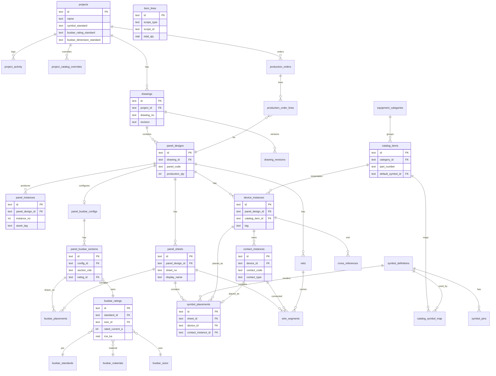

# TANON — Data Structure & Relations

## Entity Hierarchy

```
Project (proj-e22)
└── Drawing (E22-111)
    ├── Panel Design: MDB1  [qty=1]
    │   ├── Sheets: ELE A01 … A20
    │   ├── Devices: K1, Q1 … (tag unique per panel)
    │   ├── Contacts: K1/13-14, K1/A1-A2 … (interlock)
    │   ├── Placements: symbol on each sheet
    │   ├── Nets & Wires
    │   └── Busbar Config → Sections → Placements
    │
    └── Panel Design: DB  [qty=10]
        ├── Sheets: ELE B01 … B03  (shared design)
        ├── Instances: DB-01 … DB-10
        ├── Devices / Contacts / Wires
        └── Busbar Config
```

## ER Diagram (Full)



## Key Relations Explained

| From | To | Cardinality | Rule |
|------|----|-------------|------|
| `projects` | `drawings` | 1:N | โปรเจกต์มีหลาย drawing |
| `drawings` | `panel_designs` | 1:N | E22-111 มี MDB1 + DB |
| `panel_designs` | `panel_instances` | 1:N | DB qty=10 → 10 instances |
| `panel_designs` | `panel_sheets` | 1:N | MDB1 → A01-A20 |
| `panel_designs` | `device_instances` | 1:N | tag unique ต่อ panel |
| `device_instances` | `contact_instances` | 1:N | interlock identity |
| `contact_instances` | `symbol_placements` | 1:0..1 | contact วางได้ 1 ที่ |
| `symbol_placements` | `panel_sheets` | N:1 | อยู่บน sheet |
| `catalog_items` | `device_instances` | 1:N | อุปกรณ์จาก catalog |
| `catalog_symbol_map` | — | M:N bridge | catalog ↔ symbols |
| `panel_busbar_configs` | `panel_busbar_sections` | 1:N | main + feeders |
| `busbar_ratings` | `busbar_sizes` | N:1 | DIN 43671 size |
| `bom_lines.scope_id` | polymorphic | — | panel / drawing / project |

## Scope & Uniqueness Rules

```
UNIQUE (project_id, drawing_no, revision)     → E22-111 Rev A
UNIQUE (drawing_id, panel_code)               → MDB1, DB
UNIQUE (panel_design_id, sheet_no)            → A01, B02
UNIQUE (panel_design_id, tag)                 → K1 per panel only
UNIQUE (device_id, contact_code)              → K1/13-14
UNIQUE (panel_design_id, instance_no)         → DB #01-#10
```

## BOM Aggregation Chain

```
device_instances (per panel design)
    ↓ qty_per_unit
panel_designs.production_qty
    ↓ × panel_qty
drawing (sum all panels in drawing)
    ↓
project (sum all drawings)
```

## Example Query Paths

**All sheets in drawing E22-111:**
```
drawings → panel_designs → panel_sheets
WHERE drawing_no = 'E22-111'
ORDER BY panel_designs.sort_order, panel_sheets.sort_order
```

**Interlock: all placements of device K1 in MDB1:**
```
device_instances (tag='K1', panel=MDB1)
  → contact_instances
  → symbol_placements
  → panel_sheets (cross-sheet)
```

**Mass BOM for DB × 10:**
```
device_instances WHERE panel_design_id = 'panel-db'
  → GROUP BY catalog_item_id
  → total_qty = SUM(qty) × production_qty(10)

panel_busbar_sections WHERE config.panel_design_id = 'panel-db'
  → total busbar × 10
```
